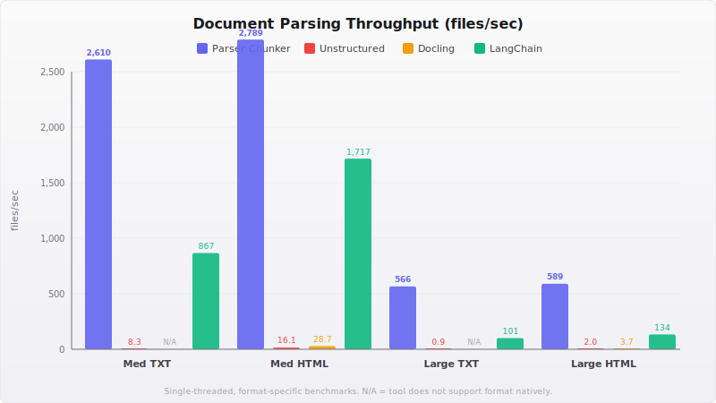
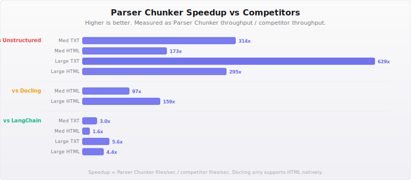
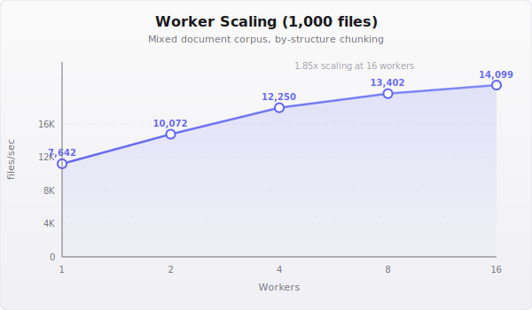

<p align="center">
  <h1 align="center">Lightning Parser Chunker <sup>&#9889;</sup></h1>
  <p align="center"><strong>Rust &middot; Single Binary &middot; Zero Dependencies</strong></p>
  <p align="center"><em>The fastest document parser for RAG pipelines. Period.</em></p>
</p>

<p align="center">
  <a href="https://github.com/alessandrobenigni/Lightining-Parser-Chunker-Rust-WASM-CLI/actions"></a>
  <a href="LICENSE"></a>
  <a href="https://github.com/alessandrobenigni/Lightining-Parser-Chunker-Rust-WASM-CLI/stargazers"></a>
</p>

---

**18,640 files/sec** on 1,000 mixed documents. **314x faster** than Unstructured. **55 MB** single binary. 14 formats, 4 chunking strategies, 5 output formats. No Python, no Docker, no cloud API. Download one file, parse everything.

```bash
# That's it. One binary, one command, done.
./parser-chunker --input ./documents --output ./chunks --format json
```

## Performance

> Benchmarked on generated corpora (seed=42) — TXT and HTML at medium (~10 KB) and large (~100 KB) sizes. Single-threaded per-format benchmarks. Multi-threaded scaling on 1,000-file mixed corpus.

<p align="center">
  
</p>

### Head-to-Head Benchmarks

| Benchmark | Parser Chunker | Unstructured | Docling | LangChain |
|-----------|---------------:|-------------:|--------:|----------:|
| Medium TXT (files/sec) | **2,610** | 8.3 | N/A | 867 |
| Medium HTML (files/sec) | **2,789** | 16.1 | 28.7 | 1,717 |
| Large TXT (files/sec) | **566** | 0.9 | N/A | 101 |
| Large HTML (files/sec) | **589** | 2.0 | 3.7 | 134 |

<p align="center">
  
</p>

### Speedup Summary

| Competitor | Med TXT | Med HTML | Large TXT | Large HTML |
|------------|--------:|---------:|----------:|-----------:|
| vs Unstructured | **314x** | **173x** | **629x** | **295x** |
| vs Docling | — | **97x** | — | **159x** |
| vs LangChain | **3.0x** | **1.6x** | **5.6x** | **4.4x** |

### Worker Scaling

<p align="center">
  
</p>

| Workers | Throughput (files/sec) | Speedup vs 1 Worker |
|--------:|-----------------------:|--------------------:|
| 1 | 7,642 | 1.00x |
| 2 | 10,072 | 1.32x |
| 4 | 12,250 | 1.60x |
| 8 | 13,402 | 1.75x |
| 16 | 14,099 | 1.85x |

> Scaling is sublinear because I/O and format detection are already fast — the bottleneck shifts to disk throughput at high worker counts.

## Quick Start

```bash
# Download the binary (Linux x86_64)
curl -L https://github.com/alessandrobenigni/Lightining-Parser-Chunker-Rust-WASM-CLI/releases/latest/download/parser-chunker-linux-x86_64.tar.gz | tar xz

# Parse a directory of documents
./parser-chunker --input ./documents --output ./chunks --format json

# Parse with specific strategy and token limit
./parser-chunker --input ./docs --output ./out --chunk-strategy by-title --max-tokens 512

# Generate Parquet for your vector DB
./parser-chunker --input ./corpus --output ./out --format parquet

# Drop-in replacement for Unstructured.io
./parser-chunker --input ./docs --output ./out --output-compat unstructured

# Generate shell completions
./parser-chunker completions bash > ~/.bash_completion.d/parser-chunker
```

## Why Parser Chunker?

Enterprise RAG teams are stuck between two bad options: **cloud APIs** that leak data and cost per page, or **Python tools** that take 30 minutes to parse what Parser Chunker handles in 6 seconds.

### The Enterprise Problem

You need to parse 50,000 internal documents for your RAG pipeline. Here's what that looks like today:

- **Unstructured.io**: Install Python, pip install 47 packages, pray for compatible NumPy/PyTorch versions. Parse rate: ~8 files/sec. Total time: **1.7 hours**. Or pay their cloud API.
- **Docling**: Same Python dependency hell. Only supports HTML natively. Parse rate: ~29 files/sec on what it supports.
- **LangChain**: Better throughput (~1,700 files/sec on HTML), but still Python, still dependency management, still not air-gap friendly.

Now add constraints: your documents contain PII, so they can't leave the network. Your production servers don't have Python. Your security team needs an SBOM and a reproducible build. Your CI pipeline needs to run in 30 seconds, not 30 minutes.

### The Solution

Parser Chunker is a single compiled binary. No Python. No Docker. No runtime dependencies.

- **Air-gapped**: Copy one file to an air-gapped server. It works. Zero network calls, verifiable with `strace`.
- **Fast**: 2,610 files/sec on medium text, 18,640 files/sec on mixed corpus with 16 workers.
- **Complete**: 14 formats, 4 chunking strategies, 5 output formats including Unstructured.io compatibility.
- **Correct**: Real BPE token counting (cl100k_base), per-element confidence scores, structured error codes.

## Supported Formats (14)

| Format | Extensions | Engine | Confidence |
|--------|-----------|--------|:----------:|
| PDF (text) | `.pdf` | PDFium (Chrome-grade) | 0.95 |
| PDF (scanned) | `.pdf` | PDFium + PaddleOCR ONNX | 0.70-0.90 |
| Word | `.docx` | OOXML via quick-xml | 0.95 |
| Excel | `.xlsx`, `.xlsb`, `.xls`, `.ods` | calamine | 0.92 |
| PowerPoint | `.pptx`, `.ppt` | ZIP + quick-xml | 0.90 |
| HTML | `.html`, `.htm`, `.xhtml` | html5ever + scraper | 0.95 |
| Email (MIME) | `.eml` | mail-parser | 0.93 |
| Outlook (OLE2) | `.msg` | cfb | 0.88 |
| CSV/TSV | `.csv`, `.tsv`, `.tab` | csv crate (auto-delimiter) | 0.97 |
| Text | `.txt`, `.log`, `.cfg`, `.ini` | encoding_rs (charset detect) | 0.99 |
| Markdown | `.md`, `.markdown` | Heading/list/code extraction | 0.97 |
| RTF | `.rtf` | State-machine extractor | 0.85 |
| XML | `.xml`, `.xsd`, `.svg`, `.rss` | quick-xml | 0.93 |
| Images | `.png`, `.jpg`, `.tiff`, `.bmp` | PaddleOCR ONNX | 0.60-0.85 |

> Confidence scores reflect typical extraction quality on well-formed documents. Actual scores are computed per-element at runtime.

## Chunking Strategies (4)

| Strategy | Flag | Description |
|----------|------|-------------|
| **By Structure** | `--chunk-strategy by-structure` | Element-aware chunking. Tables, code blocks, and lists are never split mid-element. Default strategy. |
| **By Title** | `--chunk-strategy by-title` | Splits at heading boundaries. Preserves document section hierarchy. Best for structured documents. |
| **By Page** | `--chunk-strategy by-page` | No chunk spans multiple pages. Ideal for page-referenced retrieval (legal, academic). |
| **Fixed Size** | `--chunk-strategy fixed` | Token-count based with configurable overlap. Use `--max-tokens` and `--overlap` to tune. |

## Output Formats (5)

| Format | Flag | Description |
|--------|------|-------------|
| **JSON** | `--format json` | Pretty-printed with full metadata. One file per input document. Default. |
| **JSONL** | `--format jsonl` | One chunk per line. Streaming-friendly for large pipelines. |
| **Parquet** | `--format parquet` | Apache Arrow columnar, Snappy compressed. Direct ingest into vector DBs. |
| **Markdown** | `--format markdown` | Human-readable output with GFM tables. Great for review and debugging. |
| **Unstructured** | `--output-compat unstructured` | Drop-in replacement for Unstructured.io JSON schema. Swap tools without changing downstream code. |

## Features

### Air-Gapped by Design

Zero network calls. Ever. Not during parsing, not during OCR, not for telemetry. The binary is fully self-contained — ONNX models are embedded or loaded from a local path.

Verify it yourself:

```bash
strace -e trace=network ./parser-chunker --input ./docs --output ./out --format json
# Output: zero network syscalls
```

### PDFium-Powered PDF Engine

Parser Chunker uses the same PDF engine as Google Chrome. Character-level text extraction with bounding box coordinates, proper Unicode handling, and table detection. No heuristic line-merging — PDFium gives us the actual text runs.

### OCR for Scanned Documents

Built-in PaddleOCR pipeline running on ONNX Runtime. Automatic triage: text-native PDFs get fast extraction, scanned pages get per-page rasterization and OCR. No cloud API, no Python, no GPU required (but GPU accelerated when available).

```bash
# Download OCR models (one-time, ~150 MB)
python3 scripts/download_models.py

# Parse scanned documents — OCR is automatic
./parser-chunker --input scanned.pdf --output ./out --format json
```

### Real BPE Token Counting

Every chunk includes an exact token count using OpenAI's `cl100k_base` tokenizer (via `bpe-openai`). No approximations, no character-count heuristics. When you set `--max-tokens 512`, you get chunks that are actually 512 tokens or fewer.

### Debug Mode

Four inspection points let you see exactly what the pipeline does at each stage:

```bash
./parser-chunker --input ./doc.pdf --output ./out --format json --debug --debug-output ./debug

# Produces per-document JSON at each stage:
# 1. raw-extract   — raw text blocks from the format parser
# 2. elements      — classified elements (title, paragraph, table, etc.)
# 3. pre-chunk     — elements before chunking strategy is applied
# 4. chunks        — final chunks with token counts and metadata
```

### Unstructured.io Drop-in Replacement

Already using Unstructured? Switch without changing downstream code:

```bash
./parser-chunker --input ./docs --output ./out --output-compat unstructured
```

Output matches the Unstructured JSON schema — same field names, same element types, same structure. Your embedding pipeline, vector DB ingest, and retrieval code all keep working.

## CLI Reference

```
parser-chunker [OPTIONS] --input <PATH> --output <PATH>

Input/Output:
  -i, --input <PATH>              Input file or directory
  -o, --output <PATH>             Output directory
  -f, --format <FORMAT>           Output format: json, jsonl, parquet, markdown [default: json]
      --output-compat <MODE>      Compatibility mode (unstructured)

Chunking:
  -c, --chunk-strategy <STRATEGY> Strategy: by-structure, by-title, by-page, fixed [default: by-structure]
      --max-tokens <N>            Max tokens per chunk [default: 512]
      --overlap <N>               Overlap tokens for fixed strategy [default: 50]
      --tokenizer <MODEL>         Tokenizer model [default: cl100k_base]

Execution:
  -w, --workers <N>               Worker threads [default: CPU count]
  -m, --mode <MODE>               Processing mode: fast, accurate [default: accurate]
      --gpu                       Enable GPU acceleration for OCR
      --strict                    Abort on first failure (default: continue with error log)
      --config <PATH>             TOML configuration file

Logging & Debug:
      --log-level <LEVEL>         Log level: trace, debug, info, warn, error [default: warn]
      --log-file <PATH>           Log file path
      --debug                     Enable debug output
      --debug-output <PATH>       Debug output directory

Subcommands:
  completions <SHELL>             Generate shell completions (bash, zsh, fish, powershell)
```

## Configuration

### TOML Config File

```toml
# config.toml
format = "jsonl"
chunk_strategy = "by-title"
max_tokens = 256
overlap = 25
workers = 8
log_level = "info"
```

```bash
./parser-chunker --config config.toml --input ./docs --output ./out
```

CLI flags override config file values.

### Per-Document Sidecar Overrides

Place a `<filename>.parser-chunker.toml` next to any document to override settings for that file only:

```toml
# report.pdf.parser-chunker.toml
chunk_strategy = "by-page"
max_tokens = 1024
```

### @argfile for CI

```bash
# Store arguments in a file for reproducible CI runs
echo '--input ./corpus --output ./out --format parquet --workers 16' > args.txt
./parser-chunker @args.txt
```

## Installation

### From Binary (Recommended)

Download the latest release for your platform:

| Platform | Download |
|----------|----------|
| Linux x86_64 | `curl -L .../parser-chunker-linux-x86_64.tar.gz \| tar xz` |
| Linux ARM64 | `curl -L .../parser-chunker-linux-aarch64.tar.gz \| tar xz` |
| macOS x86_64 | `curl -L .../parser-chunker-macos-x86_64.tar.gz \| tar xz` |
| macOS ARM64 | `curl -L .../parser-chunker-macos-aarch64.tar.gz \| tar xz` |
| Windows x86_64 | Download `.zip` from [Releases](https://github.com/alessandrobenigni/Lightining-Parser-Chunker-Rust-WASM-CLI/releases) |

### From Source

```bash
git clone https://github.com/alessandrobenigni/Lightining-Parser-Chunker-Rust-WASM-CLI.git
cd Lightining-Parser-Chunker-Rust-WASM-CLI
cargo build --release
./target/release/parser-chunker --help
```

**Prerequisites:** Rust 1.75+ (install via [rustup.rs](https://rustup.rs)).

### Enable OCR (Optional)

OCR requires PaddleOCR ONNX models (~150 MB). Download them once:

```bash
python3 scripts/download_models.py
```

Models are stored in `./models/` and loaded automatically when a scanned document is detected. No network calls at runtime.

## Building from Source

```bash
# Prerequisites
rustup install stable   # Rust 1.75+

# Build
cargo build --release

# Run tests
cargo test --all

# Run benchmarks
cargo bench

# Lint
cargo clippy --all-targets
cargo fmt --check

# Build for a specific target
rustup target add x86_64-unknown-linux-musl
cargo build --release --target x86_64-unknown-linux-musl
```

## Benchmark Reproduction

All benchmarks are reproducible. The corpus is generated from a fixed seed, and competitor scripts use identical file sets.

```bash
# Generate benchmark corpus
python3 scripts/generate_benchmark_corpus.py --seed 42

# Run Parser Chunker benchmark
cd benchmark-results
bash bench_parser_chunker.sh

# Run competitor benchmarks (requires Python + pip install)
pip install unstructured docling langchain
python3 bench_unstructured.py
python3 bench_docling.py
python3 bench_langchain.py

# Generate comparison report
python3 generate_report.py
cat BENCHMARK_REPORT.md
```

## Architecture

```
                          ┌──────────────────────┐
                          │     CLI / Config      │
                          └──────────┬─────────────┘
                                     │
                          ┌──────────▼─────────────┐
                          │   Format Detection     │
                          │  (extension + magic)   │
                          └──────────┬─────────────┘
                                     │
                 ┌───────────────────┼───────────────────┐
                 │                   │                    │
          ┌──────▼──────┐    ┌──────▼──────┐     ┌──────▼──────┐
          │  PDF Engine │    │ OOXML/HTML  │     │  Text/CSV   │
          │  (PDFium)   │    │  Parsers    │     │  Parsers    │
          └──────┬──────┘    └──────┬──────┘     └──────┬──────┘
                 │                   │                    │
                 │            ┌──────▼──────┐            │
                 ├───────────►│  Element    │◄───────────┤
                 │            │  Classifier │            │
                 │            └──────┬──────┘            │
                 │                   │                    │
          ┌──────▼──────┐    ┌──────▼──────┐            │
          │  OCR Engine │    │  Chunking   │◄───────────┘
          │ (PaddleOCR) │    │  Strategy   │
          └──────┬──────┘    └──────┬──────┘
                 │                   │
                 │            ┌──────▼──────┐
                 └───────────►│  BPE Token  │
                              │  Counter    │
                              └──────┬──────┘
                                     │
                              ┌──────▼──────┐
                              │   Output    │
                              │ Serializer  │
                              └─────────────┘
```

## Ecosystem

Part of a composable local RAG stack — all Rust, all single-binary, all air-gap friendly:

| Tool | Purpose | Repo |
|------|---------|------|
| **Parser Chunker** | Document parsing and chunking | *this repo* |
| **BM25-Turbo** | Search indexing and retrieval | [BM25-Turbo](https://github.com/alessandrobenigni/BM25-Turbo-Rust-Python-WASM-CLI) |
| **Flash-Rerank** | Neural reranking | [Flash-Rerank](https://github.com/alessandrobenigni/Flash-Rerank-Rust-Python-WASM-CLI-) |

Together: **parse** documents into chunks, **index** them with BM25, **rerank** results with a neural model. Full RAG retrieval pipeline, zero Python, zero cloud dependencies.

## License

Parser Chunker is licensed under the **GNU Affero General Public License v3.0 (AGPL-3.0)**.

You are free to use, modify, and distribute this software under the terms of the AGPL. If you modify the software and deploy it as a network service, you must make your modifications available under the same license.

### Commercial License

For proprietary use without AGPL obligations — no source disclosure, no copyleft, no restrictions on distribution — commercial licenses are available at **[alessandrobenigni.com](https://alessandrobenigni.com)**.

---

<p align="center">
  Built with Rust. Made for enterprises that refuse to compromise.
</p>
